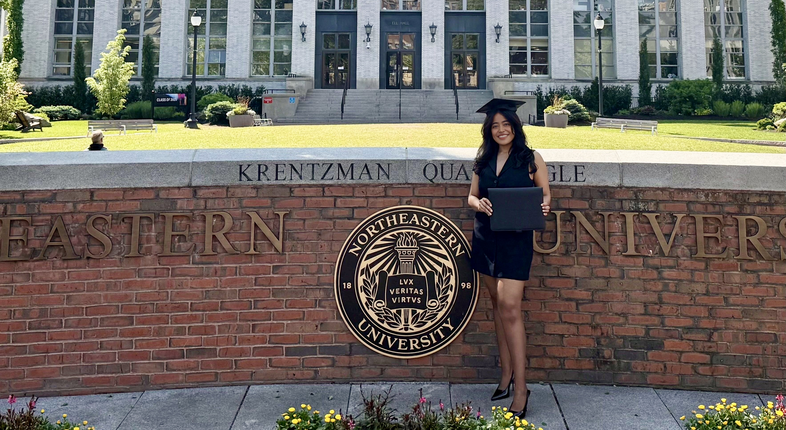
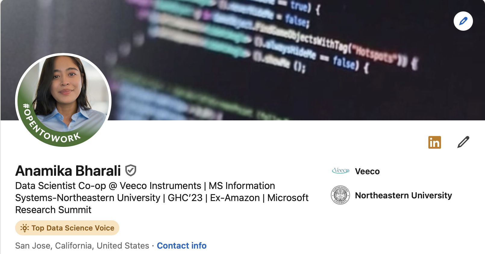

## Hellowww!

"Life is a climb, but the view is great!"

I’m an engineer at heart: I hate fixing the same problem twice and will happily spend extra time to fix it well once. 
  Future entrepreneur - naturally, I love studying businesses and what drives them.  
In love with experimentation — whether it’s with data, ideas, or biohacking solutions.  
Type A, a bit neurotic  

  

- **Background:** MS in Computer Software Engineering (Northeastern University)
- **Experience:** 4 years as a Data Scientist / AI explorer with Amazon, Tata, and now Humanitarians AI
- **What I do:** Build data-driven solutions, currently AI solutions (I hate that this is trending right now 🙄)
- **Hobbies:** Trained in tennis, love squash & swimming. I love to sing. Boxing and surfing are on the list. For now? Aiming at being a Pilates/gym girly.

 Some recent sprinkles ✨: Top Voice Badge on LinkedIn

  

